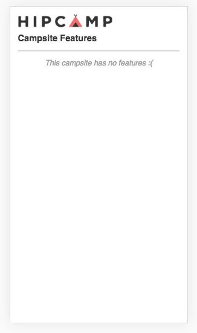
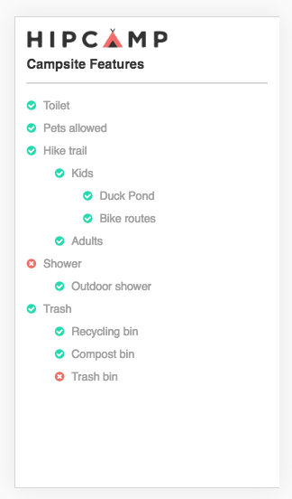

## Instructions

Using JavaScript (React preferred), CSS (Sass preferred) and the initial
template file campground.html, please reveal the top level camp features
as a `<ul>` list, based on the sample JSON structure defined in camp_features.js
(let’s assume this JSON structure is what an API could return).

Indicate whether or not each feature is present at the campground.
Clicking on a feature should reveal its sub-features, if they're present or
not, and so on.

The presence or absence of each feature may be indicated with an icon, a
different color, or both. Feel free to make it look great!

Each `<li>` element should be a bubble that's clickable in case there are
sub-features to reveal. Sub-features should be displayed in a nested `<ul>` list.

Adding or removing features from camp_features.js should automatically update the
DOM when the page is reloaded.

Clear, concise, "production-ready" code will be appreciated.

## Result

### When no features to render


### When multi level featuers present


This project presents as deliverable a React ListWidget component that given an array of features renders a configurable first level of items and consequent level of clickble children. This widget is mounted in hypothetical environment call HipcampContainer.

ListWidget component requires an array of features.  

Features are objet that comply with the following types contract:
```
  feature = {
   title: <string>,
   presence: <boolean>,
   subfeatures: <feature[]>
  }
```

## Run
#### Install dependencies  
`$ npm install`  

#### Serve  
`$ npm run dev-server`  

#### Change input  
Navigate to `src/utils/camp_features.js` and modify the file following the contract.


## Notes:
In order to use JSX to write React code and to better integrate SASS I decided to use NPM, Babel and Webpack.   

This example could have been written without the use of those tools but it could have require me to use the SASS CLI and to write React code in a way that can be considerer not "production-ready".  

* Using campground.html as index.html
* Consuming `camp_features.js` from `src/utils/camp_features.js`
* Using Webpack + Babel:
  * JSX as React production code in order to do not have to write DOM elements like this:
    ```javascript
      React.createElement('div', null,
        React.createElement('h1', null, 'Camp Features'),
        React.createElement('ListWidget', { features : [{},{}]] }),
      )
    ```
  * SASS code converted to CSS
  * To transform class properties into ES5
* Webpack loads files, url assets and fonts

Includes type validations and handling edge cases.  

## More

I had a great time working on this exercise and it was really exiting thinking about working for the Hipcamp team!
